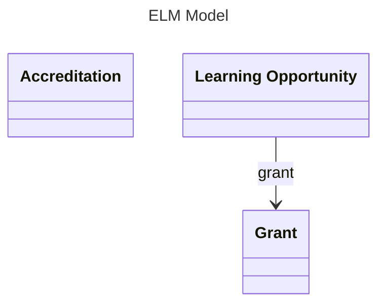

```mermaid
---
title: ELM Model
description: European Learning Model data model diagrammed using Mermaid.
---
classDiagram
        class Accreditation["Accreditation"]
        class LearningOpportunity["Learning Opportunity"]
        class Grant["Grant"]

    LearningOpportunity --> Grant : grant
```