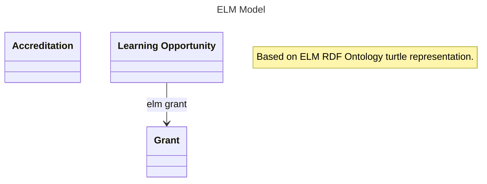

```mermaid
---
title: ELM Model
description: European Learning Model data model diagrammed using Mermaid.
---
classDiagram
   note "Based on ELM RDF Ontology turtle representation."

    class `elm:Accreditation`["Accreditation"]
    class `elm:LearningOpportunity`["Learning Opportunity"]
    class `elm:Grant`["Grant"]

   `elm:LearningOpportunity` --> `elm:Grant` : elm grant
```