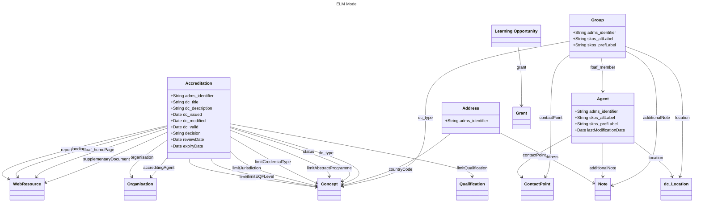

```mermaid
---
title: ELM Model
description: European Learning Model data model diagrammed using Mermaid.
---
classDiagram
    class Accreditation["Accreditation"]{
        +String adms_identifier
        +String dc_title
        +String dc_description
        +Date dc_issued
        +Date dc_modified
        +Date dc_valid
        +String decision
        +Date reviewDate
        +Date expiryDate
    }
    Accreditation --> WebResource : report
    Accreditation --> Organisation : organisation
    Accreditation --> Qualification : limitQualification
    Accreditation --> Concept : limitField
    Accreditation --> Concept : limitEQFLevel
    Accreditation --> Concept : limitJurisdiction
    Accreditation --> Concept : limitCredentialType
    Accreditation --> Concept : limitAbstractProgramme
    Accreditation --> Concept : status
    Accreditation --> Concept : dc_type
    Accreditation --> Organisation : accreditingAgent
    Accreditation --> WebResource : landingPage
    Accreditation --> WebResource : foaf_homePage
    Accreditation --> WebResource : supplementaryDocument
    class Address["Address"]{
        +String adms_identifier

    }
    Address --> Note : fullAddress
    Address --> Concept : countryCode
    class Agent["Agent"]{
        +String adms_identifier
        +String skos_altLabel
        +String skos_prefLabel
        +Date lastModificationDate
    }
    Agent --> Note : additionalNote
    Agent --> dc_Location : location
    Agent --> ContactPoint : contactPoint
    class Group["Group"]{
        +String adms_identifier
        +String skos_altLabel
        +String skos_prefLabel
    }
    Group --> Concept : dc_type
    Group --> Note : additionalNote
    Group --> dc_Location : location
    Group --> ContactPoint : contactPoint
    Group --> Agent : foaf_member


    class LearningOpportunity["Learning Opportunity"]
    LearningOpportunity --> Grant : grant
    class Qualification["Qualification"]
    class Grant["Grant"]
```