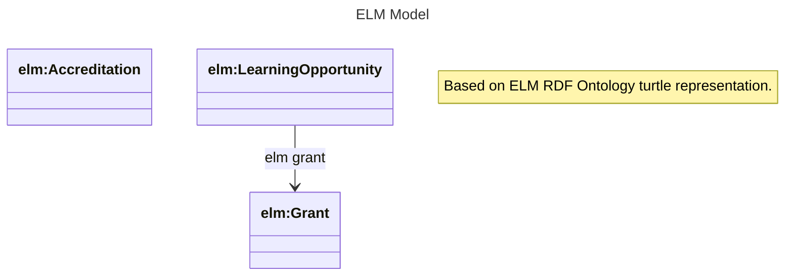

```mermaid
---
title: ELM Model
description: European Learning Model data model diagrammed using Mermaid.
---
classDiagram
   note "Based on ELM RDF Ontology turtle representation."

    class `elm:Accreditation`
    class `elm:LearningOpportunity`
    class `elm:Grant`

   `elm:LearningOpportunity` --> `elm:Grant` : elm grant
```