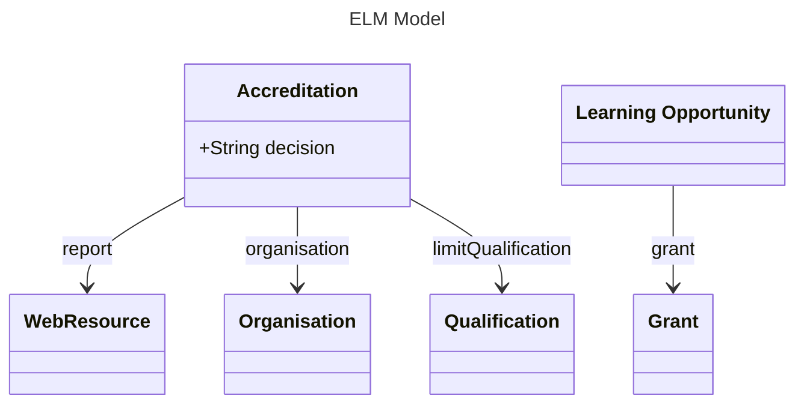

```mermaid
---
title: ELM Model
description: European Learning Model data model diagrammed using Mermaid.
---
classDiagram
    class Accreditation["Accreditation"]{
        +String decision
    }
    Accreditation --> WebResource : report
    Accreditation --> Organisation : organisation
    Accreditation --> Qualification : limitQualification
    class LearningOpportunity["Learning Opportunity"]
    LearningOpportunity --> Grant : grant
    class Qualification["Qualification"]
    class Grant["Grant"]
```