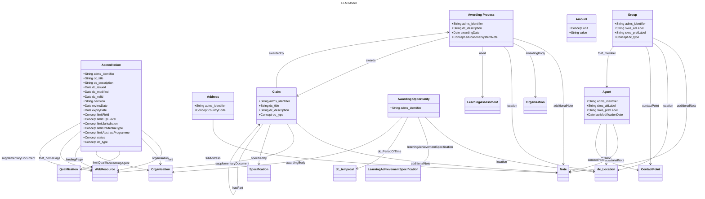

```mermaid
---
title: ELM Model
description: European Learning Model data model diagrammed using Mermaid.
---
classDiagram
%%=========
%% Accreditation
%%=========
    class Accreditation["Accreditation"]{
        +String adms_identifier
        +String dc_title
        +String dc_description
        +Date dc_issued
        +Date dc_modified
        +Date dc_valid
        +String decision
        +Date reviewDate
        +Date expiryDate
        +Concept limitField
        +Concept limitEQFLevel
        +Concept limitJurisdiction
        +Concept limitCredentialType
        +Concept limitAbstractProgramme
        +Concept status
        +Concept dc_type
    }
    Accreditation --> WebResource : report
    Accreditation --> Organisation : organisation
    Accreditation --> Qualification : limitQualification
    Accreditation --> Organisation : accreditingAgent
    Accreditation --> WebResource : landingPage
    Accreditation --> WebResource : foaf_homePage
    Accreditation --> WebResource : supplementaryDocument
%%=========
%% Address
%%=========
    class Address["Address"]{
        +String adms_identifier
        +Concept countryCode
    }
    Address --> Note : fullAddress
%%=========
%% Agent
%%=========
    class Agent["Agent"]{
        +String adms_identifier
        +String skos_altLabel
        +String skos_prefLabel
        +Date lastModificationDate
    }
    Agent --> Note : additionalNote
    Agent --> dc_Location : location
    Agent --> ContactPoint : contactPoint
%%=========
%% Group
%%=========
    class Group["Group"]{
        +String adms_identifier
        +String skos_altLabel
        +String skos_prefLabel
        +Concept dc_type
    }
    Group --> Note : additionalNote
    Group --> dc_Location : location
    Group --> ContactPoint : contactPoint
    Group --> Agent : foaf_member
%%=========
%% Amount
%%=========
    class Amount["Amount"]{
        +Concept unit
        +String value
    }
%%=========
%% AwardingOpportunity
%%=========
    class AwardingOpportunity["Awarding Opportunity"]{
        +String adms_identifier
    }
    AwardingOpportunity --> dc_Location : location
    AwardingOpportunity --> LearningAchievementSpecification : learningAchievementSpecification
    AwardingOpportunity --> dc_temproal : dc_PeriodOfTime
    AwardingOpportunity --> Organisation : awardingBody 
%%=========
%% AwardingProcess
%%=========
    class AwardingProcess["Awarding Process"]{
        +String adms_identifier
        +String dc_description
        +Date awardingDate
        +Concept educationalSystemNote
    }
    AwardingProcess --> Note : additionalNote
    AwardingProcess --> Organization : awardingBody
    AwardingProcess --> dc_Location : location
    AwardingProcess --> LearningAssessment : used
    AwardingProcess --> Claim : awards
%%=========
%% Claim
%%=========
    class Claim["Claim"]{
        +String adms_identifier
        +String dc_title
        +String dc_description
        +Concept dc_type
    }
    Claim --> Note : additionalNote
    Claim --> WebResource : supplementaryDocument
    Claim --> AwardingProcess : awardedBy
    Claim --> Specification : specifiedBy
    Claim --> Claim : hasPart

```