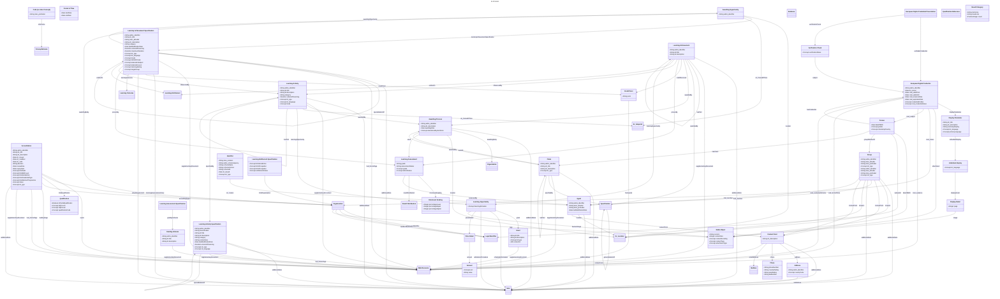

```mermaid
---
title: ELM Model
description: European Learning Model data model diagrammed using Mermaid.
---
classDiagram
%%=========
%% Accreditation
%%=========
    class Accreditation["Accreditation"]{
        +String adms_identifier
        +String dc_title
        +String dc_description
        +Date dc_issued
        +Date dc_modified
        +Date dc_valid
        +String decision
        +Date reviewDate
        +Date expiryDate
        +Concept limitField
        +Concept limitEQFLevel
        +Concept limitJurisdiction
        +Concept limitCredentialType
        +Concept limitAbstractProgramme
        +Concept status
        +Concept dc_type
    }
    Accreditation --> WebResource : report
    Accreditation --> Organisation : organisation
    Accreditation --> Qualification : limitQualification
    Accreditation --> Organisation : accreditingAgent
    Accreditation --> WebResource : landingPage
    Accreditation --> WebResource : foaf_homePage
    Accreditation --> WebResource : supplementaryDocument
    Accreditation --> Note : additionalNote
%%=========
%% Address
%%=========
    class Address["Address"]{
        +String adms_identifier
        +Concept countryCode
    }
    Address --> Note : fullAddress
%%=========
%% Agent
%%=========
    class Agent["Agent"]{
        +String adms_identifier
        +String skos_altLabel
        +String skos_prefLabel
        +Date lastModificationDate
    }
    Agent --> Note : additionalNote
    Agent --> dc_Location : location
    Agent --> ContactPoint : contactPoint
%%=========
%% Group
%%=========
    class Group["Group"]{
        +String adms_identifier
        +String skos_altLabel
        +String skos_prefLabel
        +Concept dc_type
    } 
    Group --> Note : additionalNote
    Group --> dc_Location : location
    Group --> ContactPoint : contactPoint
    Group --> Agent : foaf_member
%%=========
%% Amount
%%=========
    class Amount["Amount"]{
        +Concept unit
        +String value
    }
%%=========
%% AwardingOpportunity
%%=========
    class AwardingOpportunity["Awarding Opportunity"]{
        +String adms_identifier
    }
    AwardingOpportunity --> dc_Location : location
    AwardingOpportunity --> LearningAchievementSpecification : learningAchievementSpecification
    AwardingOpportunity --> dc_temporal : dc_PeriodOfTime
    AwardingOpportunity --> Organisation : awardingBody 
%%=========
%% Period of Time
%%=========
    class dc_PeriodOfTime["Period of Time"]{
        +Date startDate
        +Date endDate
    }
%%=========
%% AwardingProcess
%%=========
    class AwardingProcess["Awarding Process"]{
        +String adms_identifier
        +String dc_description
        +Date awardingDate
        +Concept educationalSystemNote
    }
    AwardingProcess --> Note : additionalNote
    AwardingProcess --> Organization : awardingBody
    AwardingProcess --> dc_Location : location
    AwardingProcess --> LearningAssessment : used
    AwardingProcess --> Claim : awards
%%=========
%% Claim
%%=========
    class Claim["Claim"]{
        +String adms_identifier
        +String dc_title
        +String dc_description
        +Concept dc_type
    }
    Claim --> Note : additionalNote
    Claim --> WebResource : supplementaryDocument
    Claim --> AwardingProcess : awardedBy
    Claim --> Specification : specifiedBy
    Claim --> Claim : hasPart
%%=========
%% Code
%%=========
    class Code["Code (as skos Concept)"]{
        +String skos_prefLabel
    }
    Code --> ConceptScheme : inScheme
%%======
%% Contact Point
%%======
    class ContactPoint["Contact Point"]{
        +String dc_description
    }
    ContactPoint --> Note : additionalNote
    ContactPoint --> Address : address
    ContactPoint --> Phone : phone
    ContactPoint --> Mailbox : emailAddress
    ContactPoint --> WebResource : contactForm
%%======
%% Credit Point
%%======
    class CreditPoint["Credit Point"]{
        +String point
    }
    CreditPoint --> WebResource: framework

%%======
%% Display Parameter
%%======
    class DisplayParameter ["Display Parameter"]{
        +String dc_title
        +String dc_description
        +String summaryDisplay
        +Concept dc_language
        +Concept primaryLanguage
    }
    DisplayParameter  --> IndividualDisplay : individualDisplay
%%======
%% Display Detail
%%======
    class DisplayDetail["Display Detail"]{
        +Integer page
    }
    DisplayDetail --> MediaObject : image

%%======
%% Evidence
%%======
    class Evidence["Evidence"]{
    }
%%======
%% European Digital Credential
%%======
    class EuropeanDigitalCredential["European Digital Credential"]{
        +String adms_identifier
        +Date dc_issued
        +Date cred_validFrom
        +Date cred_validUntil
        +Date cred_issuanceDate
        +Date cred_expirationDate
        +Concept  credentialProfiles
        +Concept cred_credentialStatus
    }
    EuropeanDigitalCredential --> DisplayParameter  : displayParameter
    EuropeanDigitalCredential --> MediaObject : attachment 
    EuropeanDigitalCredential --> Organisation : cred_issuer
    EuropeanDigitalCredential --> Person : cred_subject
    EuropeanDigitalCredential --> WebResource : cred_evidence 
    EuropeanDigitalCredential --> WebResource : cred_termsOfUse
    EuropeanDigitalCredential --> WebResource : cred_credentialSchema
%%======
%% European Digital Credential Presentation
%%======
    class EuropeanDigitalPresentation["European Digital Credential Presentation"]{
    }
    EuropeanDigitalPresentation --> EuropeanDigitalCredential : verifiableCredential
    EuropeanDigitalPresentation --> VerificationCheck : verificationCheck
%%======
%% Grant
%%======
    class Grant["Grant"]{
        +String dc:title
        +String dc:description
        +Concept dc:type
        +URI contentUrl
    }
    Grant --> WebResource : supplementaryDocument
%%======
%% Grading Scheme
%%======
    class GradingScheme["Grading Scheme"]{
        +String adms_identifier
        +String dc:title
        +String dc:description
    }
    GradingScheme --> WebResource : supplementaryDocument
%%=========
%% Group
%%=========
    class Group["Group"]{
        +String adms_identifier
        +String skos_altLabel
        +String skos_prefLabel
        +Concept dc_type
    }
    Group --> Note : additionalNote
    Group --> dc_Location : location
    Group --> ContactPoint : contactPoint
    Group --> Agent : foaf_member
%%======
%% Identifier
%%======
    class Identifier["Identifier"]{
        +String skos_notation
        +String adms_schemeAgency
        +String schemeName
        +String schemeVersion
        +String schemeId
        +Date dc_issued
        +Concept dc_type
    }
    Identifier --> Agent : dc_creator
%%======
%% Individual display
%%======
    class IndividualDisplay["Individual display"]{
        +Concept dc_language
    }
    IndividualDisplay --> DisplayDetail : displayDetail
%%======
%% Learning Achievement
%%======
    class LearningAchievement["Learning Achievement"]{
        +String adms_identifier
        +String dc:title
        +String dc:description
    }
    LearningAchievement --> Note : additionalNote
    LearningAchievement --> WebResource : supplementaryDocument
    LearningAchievement --> LearningAchievement: hasPart
    LearningAchievement --> Specification : specifiedBy
    LearningAchievement --> AwardingProcess : awardedBy
    LearningAchievement --> CreditPoint : creditReceived
    LearningAchievement --> LearningAssessment : provenBy
    LearningAchievement --> LearningActivity : influencedBy
    LearningAchievement --> LearningEntitlement : entitlesTo
    LearningAchievement --> LearningOpportunity : learningOpportunity
%%======
%% Learning Achievement Specification
%%======
    class LearningAchievementSpecification["Learning Achievement Specification"]{
        +String adms_identifier
        +String dc_title
        +String skos_altLabel
        +String dc_description
        +String category
        +Date lastModificationDate
        +Duration volumeOfLearning
        +Duration maximumDuration
        +Concept dc_type
        +Concept dc_language
        +Concept mode
        +Concept  ISCEDFCode
        +Concept  educationSubject
        +Concept  educationLevel
        +Concept  learningSetting
        +Concept  targetGroup
    }
    LearningAchievementSpecification --> Note : additionalNote
    LearningAchievementSpecification --> LearningAchievementSpecification : hasPart
    LearningAchievementSpecification --> LearningAchievementSpecification : specialisationOf
    LearningAchievementSpecification --> WebResource : foaf_homePage
    LearningAchievementSpecification --> WebResource : supplementaryDocument
    LearningAchievementSpecification --> Note : learningOutcomeSummary
    LearningAchievementSpecification --> CreditPoint : creditPoint
    LearningAchievementSpecification --> Note : entryRequirement
    LearningAchievementSpecification --> LearningOutcome : learningOutcome
    LearningAchievementSpecification --> AwardingOpportunity : awardingOpportunity
    LearningAchievementSpecification --> LearningAssessment : provenBy
    LearningAchievementSpecification --> LearningActivity : influencedBy
    LearningAchievementSpecification --> LearningEntitlement : entitlesTo
%%======
%% Learning Activity
%%======
    class LearningActivity["Learning Activity"]{
        +String adms_identifier
        +String dc:title
        +String dc:description
        +String category
        +Duration volumeOfLearning
        +Concept dc_type
        +Concept dc_language
        +Concept mode
    }
    LearningActivity --> Note : additionalNote
    LearningActivity --> WebResource : supplementaryDocument
    LearningActivity --> AwardingProcess : awardedBy
    LearningActivity --> dc_temporal : dc_PeriodOfTime
    LearningActivity --> LearningOpportunity : learningOpportunity
    LearningActivity --> LearningActivity : hasPart
    LearningActivity --> LearningActivitySpecification : specifiedBy

%%======
%% Learning Activity Specification
%%======
    class LearningActivitySpecification["Learning Activity Specification"]{
        +String adms_identifier
        +String skos:altLabel
        +String dc:title
        +String dc:description
        +String category
        +String contactHour
        +Date lastModificationDate
        +Duration volumeOfLearning
        +Concept dc_type
        +Concept dc_language
    }
    LearningActivitySpecification --> Note : additionalNote
    LearningActivitySpecification --> WebResource : foaf_homePage
    LearningActivitySpecification --> WebResource : supplementaryDocument
    LearningActivitySpecification --> LearningActivitySpecification : hasPart
    LearningActivitySpecification --> LearningActivitySpecification : specialisationOf

%%======
%% Learning Assessment
%%======
    class LearningAssessment["Learning Assessment"]{
        +String   grade
        +String   assessmentStatus
        +Concept  grade
        +Concept  idVerification
    }
    LearningAssessment --> ShortenedGrading : shortenedGrading
    LearningAssessment --> ResultDistribution : resultDistribution
    LearningAssessment --> Agent : assessedBy
%%======
%% Learning Assessment Specification
%%======
    class LearningAssessmentSpecification["Learning Assessment Specification"]{
    }
    LearningAssessmentSpecification --> GradingScheme : gradingScheme
%%======
%% Learning Entitlement
%%======
    class LearningEntitlement["Learning Entitlement"]{
    }
%%======
%% Learning Entitlement Specification
%%======
    class LearningEntitlementSpecification["Learning Entitlement Specification"]{
        +Concept  limitJurisdiction
        +Concept  limitOccupation
        +Concept  limitOccupation
        +Concept  entitlementStatus
    }
    LearningEntitlementSpecification --> Organisation : limitOrganisation
%%======
%% Learning Opportunity
%%======
    class LearningOpportunity["Learning Opportunity"]{
        +Concept  learningSchedule
    }
    LearningOpportunity --> Grant : grant
    LearningOpportunity --> Note : scheduleInformation
    LearningOpportunity --> Note : admissionProcedure
    LearningOpportunity --> PriceDetail : priceDetails
    LearningOpportunity --> MediaObject : bannerImage
%%======
%% Learning Outcome
%%======
    class LearningOutcome["Learning Outcome"]{
    }
%%======
%% Legal Identifier
%%======
    class LegalIdentifier["Legal Identifier"]{
    }
%%======
%% Mailbox
%%======
    class Mailbox["Mailbox"]{
    }
%%======
%% Media Object
%%======
    class MediaObject["Media Object"]{
        +String   content
        +Integer  contentSize
        +Concept  contentEncoding
        +Concept  contentType
        +Concept  attachmentType
    }
%%======
%% Note
%%======
    class Note["Note"]{
    }
%%% Remaining properties:  [rdflib.term.URIRef('http://data.europa.eu/snb/model/elm/noteLiteral'), rdflib.term.URIRef('http://data.europa.eu/snb/model/elm/noteFormat')]
%%======
%% Organisation
%%======
    class Organisation["Organisation"]{
    }
    Organisation --> LegalIdentifier : eidasLegalIdentifier
    Organisation --> LegalIdentifier : vatIdentifier
    Organisation --> LegalIdentifier : taxIdentifier
    Organisation --> MediaObject : logo
%%======
%% Person
%%======
    class Person["Person"]{
        +Date     dateOfBirth
        +Concept  gender
        +Concept  citizenshipCountry
    }
    Person --> MediaObject : dateOfBirth
    Person --> LegalIdentifier : nationalId
    Person --> Group : groupMemberOf
    Person --> EuropeanDigitalCredential : hasCredential
    Person --> Claim : hasClaim
%%======
%% Phone
%%======
    class Phone["Phone"]{
        +String   phoneNumber
        +String   countryDialing
        +String   areaDialing
        +String   dialNumber
    }
%%======
%% Price Detail
%%======
    class PriceDetail["Price Detail"]{
    }
    PriceDetail --> Amount : amount
%%======
%% Qualification
%%======
    class Qualification["Qualification"]{
        +Boolean isPartialQualification
        +Concept  EQFLevel
        +Concept  NQFLevel
        +Concept  qualificationCode
    }
%%======
%% Qualification Reference
%%======
    class QualificationReference["Qualification Reference"]{
    }
%%======
%% Result Category
%%======
    class ResultCategory["Result Category"]{
        +String   minScore
        +String   maxScore
        +PositiveInteger    count
    }
%%======
%% Result Distribution
%%======
    class ResultDistribution["Result Distribution"]{
    }
%%======
%% Shortened Grading
%%======
    class ShortenedGrading["Shortened Grading"]{
        +Integer  percentageLower
        +Integer  percentageEqual
        +Integer  percentageHigher
    }
%%======
%% Specification
%%======
    class Specification["Specification"]{
    }
    Specification --> Specification : specialisationOf
    Specification --> Specification : generalisationOf
%%======
%% Verification Check
%%======
    class VerificationCheck["Verification Check"]{
        +Concept  verificationStatus
    }
    VerificationCheck --> EuropeanDigitalCredential : subject
%%======
%% Web Resource
%%======
    class WebResource["Web Resource"]{
    }

```

%%======
%% Shacl Validator 2017
%%======
    class ShaclValidator2017["Shacl Validator 2017"]{
    }